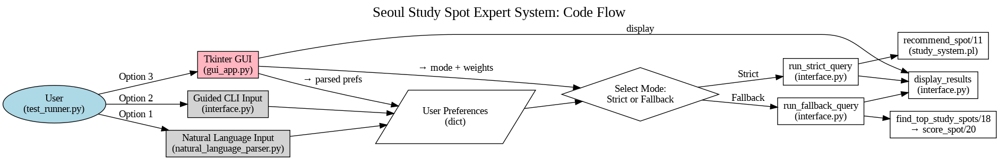
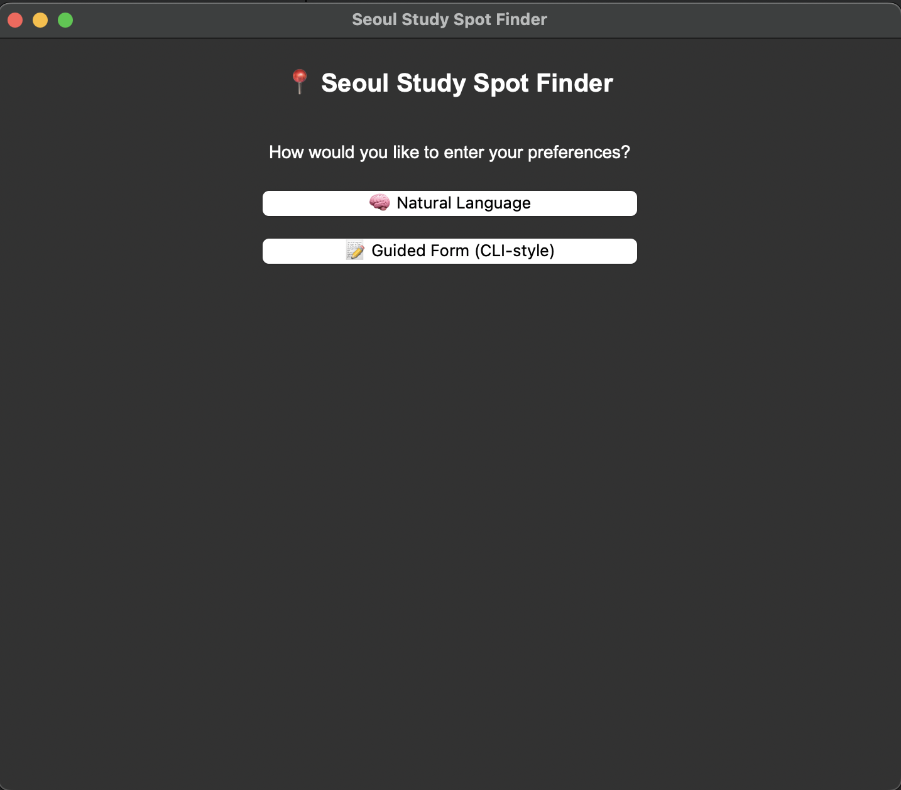
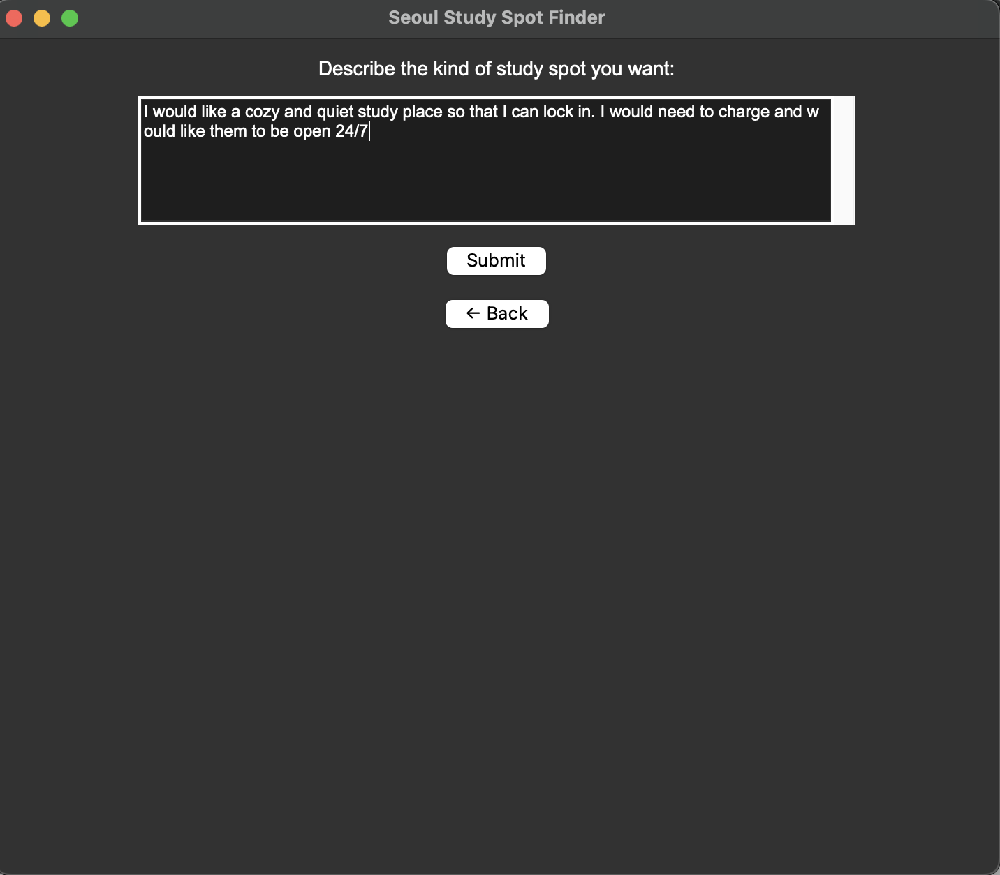
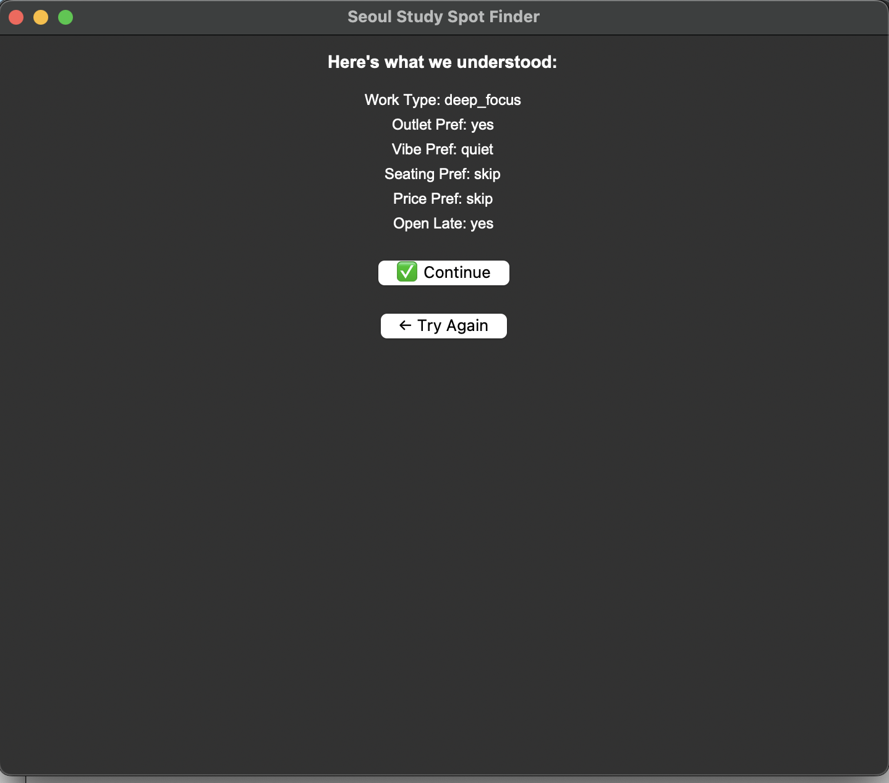
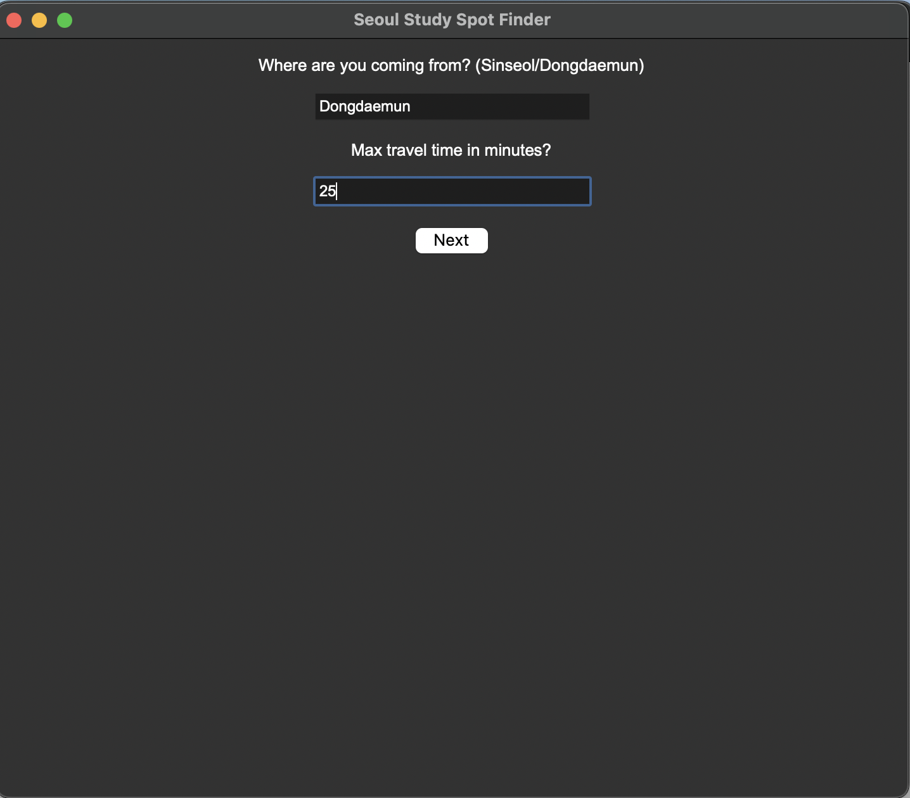
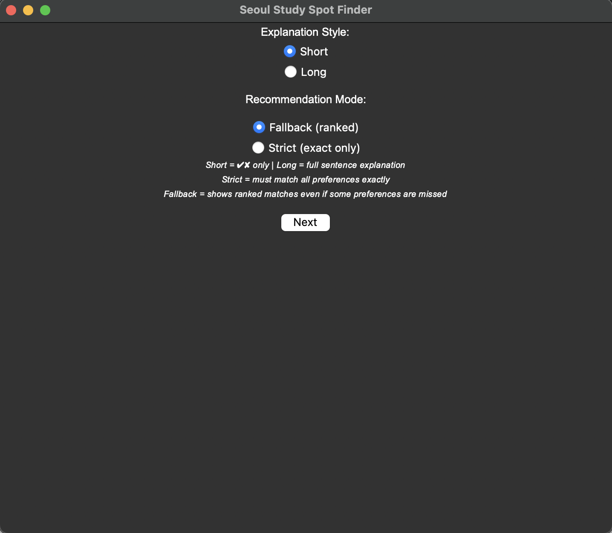
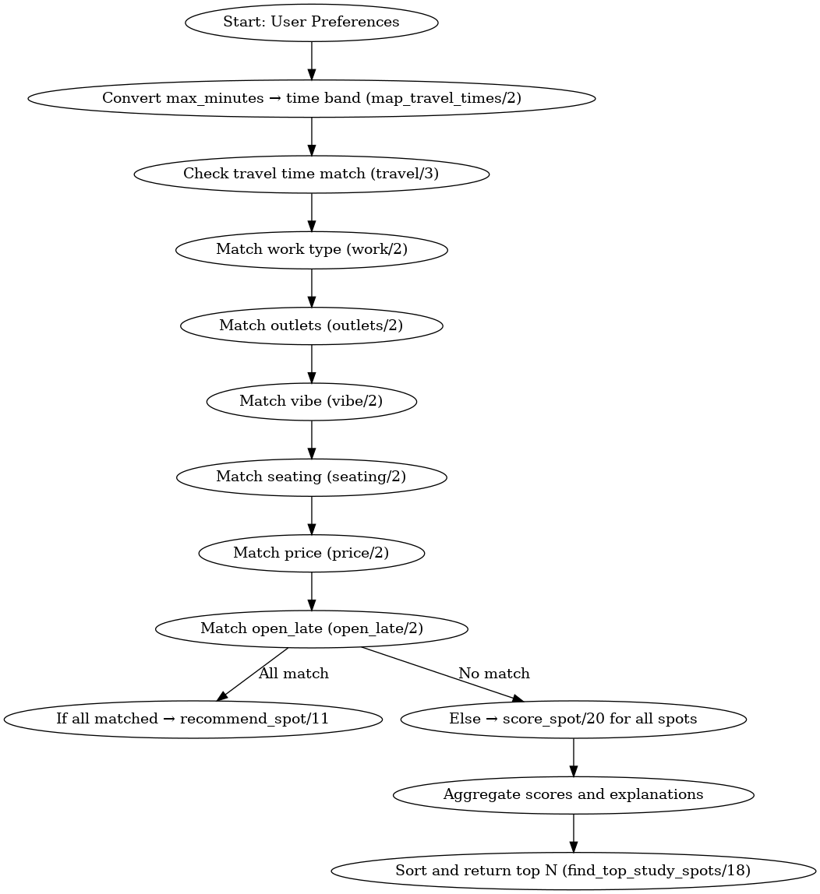

# 📍 Seoul Study Spot Expert System

An interactive expert system that recommends study spots in Seoul based on your preferences, built using **Python, Prolog, and a hybrid CLI + GUI + Web interface**. It supports both **strict (exact match)** and **fallback (ranked match)** modes with natural language input parsing.

---

## 🧠 What It Does

Living in a new city like Seoul can be overwhelming — especially when trying to find a good spot to focus. This system helps Minerva students (and others!) find the perfect cafe, library, or coworking space based on:

- Travel time from Sinseol or Dongdaemun
- Work type (deep focus, casual, group)
- Power outlet availability
- Vibe (quiet, cozy, lively)
- Seating style
- Price
- Open-late status

---

## 💡 Features

- 🧠 **Expert System** logic powered by Prolog
- 🧾 **Strict Mode**: Returns only exact matches
- 📊 **Fallback Mode**: Ranks study spots by match quality using weighted scoring
- 💬 **Natural Language Input** (e.g. "I want a cozy cafe with plugs")
- 🎛️ **CLI Form & Tkinter GUI** for interactive use
- 🌐 **Web Interface** (Flask + Bootstrap) for remote access
- 📈 **Explanations & Match Bars** to visualize why each spot was recommended
- 🔗 **Live Naver Map Links** for convenience

---

## 🚀 How to Run

### CLI Mode
```bash
python3 interface.py
```

### GUI Mode (Tkinter)
```bash
python3 gui_app.py
```

### Web Interface (Flask)
```bash
cd api
python3 index.py
```
Visit [http://localhost:5000](http://localhost:5000)

### Test Suite
```bash
python3 test_runner.py
```

---

## 📂 Project Structure

```
.
├── study_system.pl         # Prolog knowledge base
├── interface.py            # CLI interface
├── gui_app.py              # Tkinter GUI
├── api/
│   └── index.py            # Flask API for web interface
├── natural_language_parser.py
├── templates/              # HTML templates (Flask)
├── static/                 # CSS files
├── test_runner.py          # Quick test runner for CLI + GUI
├── README.md
```

---

## 🛠 Tech Stack

- 🐍 Python 3
- 🤖 Prolog (via PySWIP)
- 🖥 Tkinter (GUI)
- 🌐 Flask + Bootstrap (Web)
- 🎨 Custom CSS
- 📍 Naver Maps Integration

---

## 📸 Demo Screenshots
### 🧠 How it Works (Architecture)


> High-level overview of user input, preference parsing, mode selection, and expert system recommendation process.

---

### 🖼️ Application Walkthrough

### GUI Homepage

> The starting point for users to choose their input style: Natural Language or Guided CLI Form.

### Natural Language Input

> Users can describe their ideal study spot in plain English.

### Parsed Preferences

> The app extracts structured preferences from the text using rule-based parsing.

### Travel Preferences Input

> Users specify location and acceptable travel time.

### Mode Selection

> Choose between Strict (exact match) or Fallback (ranked, flexible) recommendation mode.

### Results Screen (Fallback Mode)

> The system ranks and explains results based on how well each spot matches user preferences.

---

### 🧬 Prolog Inference Flow


> The logic used in fallback mode to score partial matches and explain missing features.

---

## ✨ Future Improvements

- ✅ Deploy the web app via Replit/Render
- 🧠 Add more natural language patterns
- 🌍 Expand to more Seoul locations
- 🔎 Add filters like noise level, food options, etc.

---

## 🤝 Contributions

Pull requests welcome! Or [open an issue](https://github.com/temilola23/seoul-study-spot-expert-system/issues) to suggest improvements.

---

## 📝 License

MIT License © 2025 Temilola Olowolayemo
